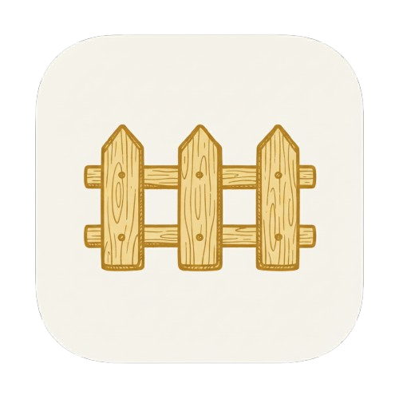
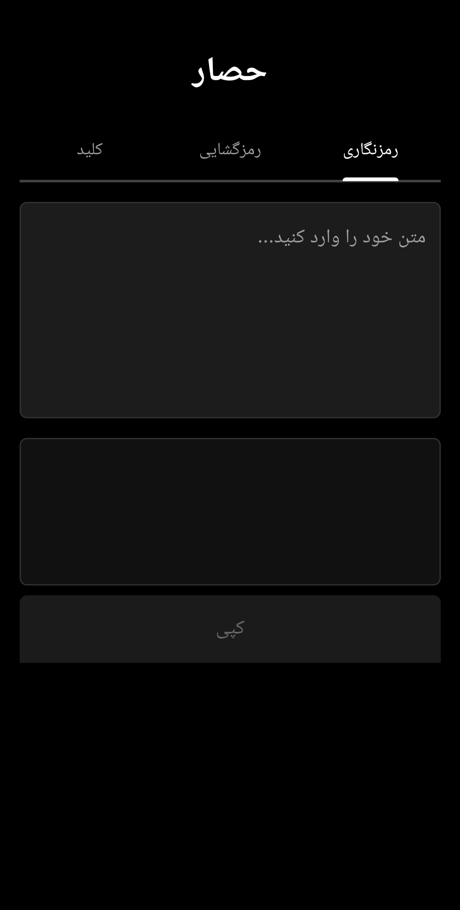
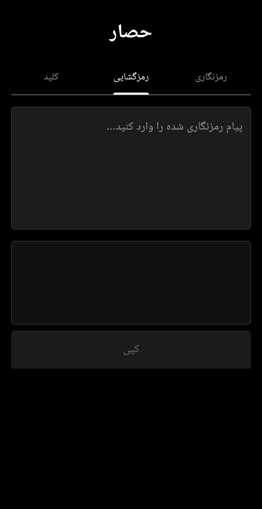
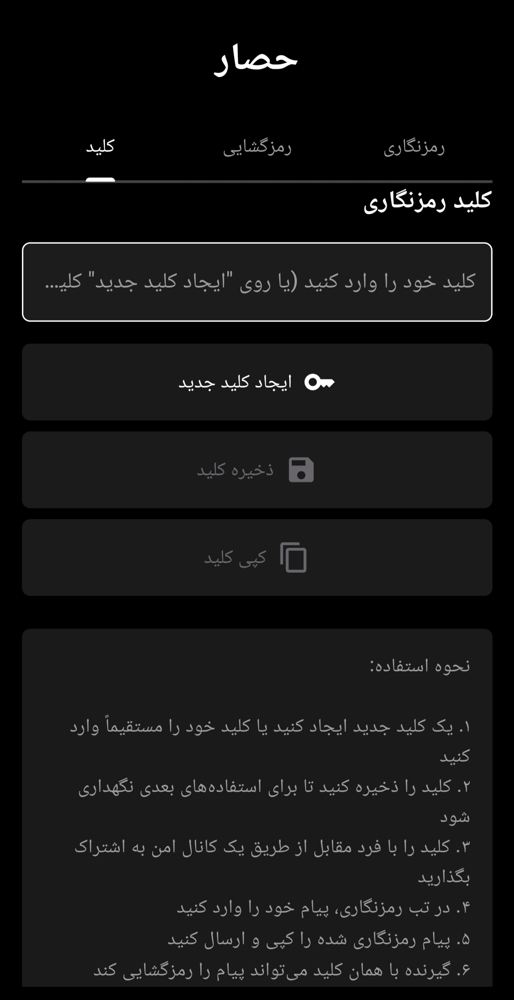

# حصار (Hesar) - رمزنگاری امن پیام

<div align="center">


**یک برنامه امن اندروید برای رمزنگاری و رمزگشایی پیام‌ها با AES-256-GCM**

[](https://github.com/CertMusashi/Hesar/actions/workflows/release.yml)
[](https://opensource.org/licenses/MIT)
[](https://flutter.dev)
[](https://www.android.com)

[English](README.md) | [فارسی](README-fa.md)

</div>

---

## 📋 فهرست مطالب

- [ویژگی‌ها](#-ویژگیها)
- [تصاویر](#-تصاویر)
- [دانلود](#-دانلود)
- [امنیت](#-امنیت)
- [شروع به کار](#-شروع-به-کار)
- [نحوه استفاده](#-نحوه-استفاده)
- [ساخت از سورس](#-ساخت-از-سورس)
- [معماری فنی](#-معماری-فنی)
- [مشارکت](#-مشارکت)
- [مجوز](#-مجوز)

---

## ✨ ویژگی‌ها

- 🔐 **رمزنگاری نظامی**: رمزنگاری AES-256-GCM با استخراج کلید PBKDF2
- 🔑 **مدیریت کلید**: ایجاد، ذخیره و اشتراک‌گذاری کلیدهای رمزنگاری به صورت امن
- 📱 **رابط کاربری مدرن**: رابط کاربری زیبا با تم تیره و پشتیبانی کامل از زبان فارسی
- 🌐 **کدگذاری خروجی فارسی**: تبدیل داده‌های رمزنگاری شده به حروف فارسی برای اشتراک‌گذاری آسان
- 💾 **ذخیره‌سازی دائمی**: ذخیره خودکار کلید رمزنگاری برای راحتی کاربر
- 🚀 **عملکرد بهینه**: ساخت APK جداگانه برای حداقل حجم برنامه
- 🔄 **رمزنگاری لحظه‌ای**: رمزنگاری/رمزگشایی آنی در هنگام تایپ
- 🎨 **Material Design**: پیروی از راهنماهای طراحی مدرن اندروید

---

## 📸 تصاویر

<div align="center">
<table>
  <tr>
    <td></td>
    <td></td>
    <td></td>
  </tr>
  <tr>
    <td align="center"><b>رمزنگاری</b></td>
    <td align="center"><b>رمزگشایی</b></td>
    <td align="center"><b>مدیریت کلید</b></td>
  </tr>
</table>
</div>

---

## 📥 دانلود

### آخرین نسخه

آخرین نسخه را از صفحه [Releases](https://github.com/CertMusashi/Dapp/releases) دانلود کنید.

### انتخاب نسخه مناسب

| معماری | توضیحات | توصیه برای |
|-------------|-------------|-----------------|
| **arm64-v8a** | دستگاه‌های ARM 64-بیتی | گوشی‌های مدرن اندروید (2017+) ⭐ |
| **armeabi-v7a** | دستگاه‌های ARM 32-بیتی | گوشی‌های قدیمی‌تر اندروید |
| **x86_64** | Intel/AMD 64-بیتی | شبیه‌سازها، کروم‌بوک‌ها |
| **x86** | Intel/AMD 32-بیتی | شبیه‌سازهای قدیمی‌تر |
| **universal** | همه معماری‌ها | اگر مطمئن نیستید (حجم بیشتر) |

**نکته**: بیشتر دستگاه‌های مدرن اندروید از معماری **arm64-v8a** استفاده می‌کنند. اگر مطمئن نیستید، نسخه universal را دانلود کنید.

---

## 🔒 امنیت

### الگوریتم رمزنگاری

حصار (Hesar) از **AES-256-GCM** (استاندارد رمزنگاری پیشرفته با حالت Galois/Counter) استفاده می‌کند که:
- ✅ توسط NIST تأیید شده و توسط دولت‌ها در سراسر جهان استفاده می‌شود
- ✅ هم محرمانگی و هم اصالت را فراهم می‌کند
- ✅ در برابر حملات شناخته شده رمزنگاری مقاوم است
- ✅ استاندارد صنعتی برای ارتباطات امن است

### استخراج کلید

- **PBKDF2** (تابع استخراج کلید مبتنی بر رمز عبور 2) با SHA-256
- **10,000 تکرار** برای جلوگیری از حملات brute-force
- هر پیام از یک **IV تصادفی منحصر به فرد** (بردار اولیه) استفاده می‌کند

### ملاحظات امنیتی

⚠️ **نکات مهم:**
- کلید رمزنگاری خود را ایمن و خصوصی نگه دارید
- کلیدها را فقط از طریق کانال‌های امن به اشتراک بگذارید (حضوری، پیام‌رسان‌های رمزنگاری شده)
- از کلیدها در برنامه‌های مختلف استفاده مجدد نکنید
- این برنامه برای استفاده شخصی و نیازهای امنیتی متوسط طراحی شده است
- برای داده‌های بسیار حساس، لایه‌های امنیتی اضافی را در نظر بگیرید

---

## 🚀 شروع به کار

### پیش‌نیازها

- دستگاه اندروید با **اندروید 5.0 (API 21)** یا بالاتر
- حدود 20 مگابایت فضای خالی

### نصب

1. APK مناسب برای دستگاه خود را از [Releases](https://github.com/CertMusashi/Dapp/releases) دانلود کنید
2. گزینه "نصب از منابع ناشناخته" را در تنظیمات اندروید فعال کنید
3. APK را نصب کنید
4. حصار (Hesar) را باز کنید و شروع به رمزنگاری کنید!

---

## 📖 نحوه استفاده

### راه‌اندازی اولیه

1. **برنامه را باز کنید** و به تب "کلید" بروید
2. **یک کلید جدید ایجاد کنید** با کلیک روی دکمه "ایجاد کلید جدید"
   - یا کلید موجود خود را به صورت دستی وارد کنید
3. **کلید را ذخیره کنید** با کلیک روی دکمه "ذخیره کلید"
4. **کلید را به اشتراک بگذارید** با گیرنده مورد نظر از طریق یک کانال امن

### رمزنگاری یک پیام

1. به تب **"رمزنگاری"** بروید
2. پیام خود را در فیلد ورودی تایپ کنید
3. پیام رمزنگاری شده به صورت خودکار ظاهر می‌شود
4. روی **"کپی"** کلیک کنید تا پیام رمزنگاری شده را کپی کنید
5. آن را از طریق هر پلتفرم پیام‌رسانی به اشتراک بگذارید

### رمزگشایی یک پیام

1. مطمئن شوید که کلید صحیح را در تب **"کلید"** وارد کرده‌اید
2. به تب **"رمزگشایی"** بروید
3. پیام رمزنگاری شده را در فیلد ورودی paste کنید
4. پیام رمزگشایی شده به صورت خودکار ظاهر می‌شود
5. روی **"کپی"** کلیک کنید تا پیام اصلی را کپی کنید

### مدیریت کلید

- **ایجاد**: یک کلید تصادفی 32 کاراکتری ایجاد می‌کند
- **ذخیره**: کلید را به صورت محلی برای استفاده بعدی ذخیره می‌کند
- **کپی**: کلید را در کلیپ‌بورد برای اشتراک‌گذاری کپی می‌کند

---

## 🛠 ساخت از سورس

### پیش‌نیازها

- **Flutter SDK**: نسخه 3.24.5 یا بالاتر
- **Android SDK**: API level 21+
- **Java**: JDK 17
- **Git**: برای clone کردن مخزن

### راه‌اندازی

```bash
# Clone کردن مخزن
git clone https://github.com/CertMusashi/Dapp.git
cd Dapp

# نصب وابستگی‌ها
flutter pub get

# اجرای برنامه در حالت debug
flutter run

# ساخت APK نسخه release (universal)
flutter build apk --release

# ساخت APK های جداگانه برای حجم کمتر
flutter build apk --release --split-per-abi
```

---

## 🏗 معماری فنی

### ساختار پروژه

```
lib/
└── main.dart          # کد اصلی برنامه با منطق رمزنگاری

android/
├── app/
│   └── build.gradle   # پیکربندی ساخت اندروید با تقسیم APK
└── ...

.github/
└── workflows/
    ├── build.yml      # CI/CD برای ساخت‌های debug
    └── release.yml    # workflow نسخه release با مدیریت نسخه
```

### جریان رمزنگاری

```
ورودی کاربر → استخراج کلید PBKDF2 → رمزنگاری AES-256-GCM
          → کدگذاری Base64 → نقشه‌برداری کاراکترهای فارسی → خروجی
```

---

## 🤝 مشارکت

مشارکت‌ها خوش‌آمدید! در اینجا نحوه کمک شما آمده است:

1. مخزن را **Fork** کنید
2. یک شاخه ویژگی **ایجاد کنید** (`git checkout -b feature/amazing-feature`)
3. تغییرات خود را **Commit** کنید (`git commit -m 'Add some amazing feature'`)
4. به شاخه **Push** کنید (`git push origin feature/amazing-feature`)
5. یک Pull Request **باز کنید**

---

## 📄 مجوز

این پروژه تحت مجوز **MIT** منتشر شده است - برای جزئیات فایل [LICENSE](LICENSE) را ببینید.

---

---

## 📞 پشتیبانی

- **مشکلات**: [GitHub Issues](https://github.com/CertMusashi/Dapp/issues)
- **بحث‌ها**: [GitHub Discussions](https://github.com/CertMusashi/Dapp/discussions)

---

<div align="center">

**ساخته شده با ❤️ برای ارتباطات امن**

[⬆ بازگشت به بالا](#حصار-hesar---رمزنگاری-امن-پیام)

</div>
